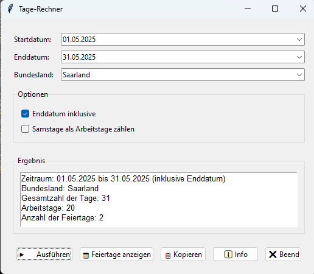

# Tage-Rechner – Arbeitstage und Feiertage in Deutschland

## Übersicht

**Tage-Rechner** ist ein komfortables Python-Tool mit grafischer Oberfläche zur Berechnung von Gesamt- und Arbeitstagen zwischen zwei beliebigen Daten. Es berücksichtigt dabei Wochenenden und alle gesetzlichen Feiertage für ein auswählbares deutsches Bundesland. Das Programm bietet viele Komfortfunktionen für den täglichen Einsatz in Büro, Verwaltung, Projektmanagement oder der privaten Planung.

## Features

- **Einfache Bedienung über eine moderne grafische Oberfläche (Tkinter)**
- **Datumsauswahl per Kalender (tkcalendar.DateEntry)**
- **Berücksichtigung aller gesetzlichen Feiertage des gewählten Bundeslands (über das [holidays](https://pypi.org/project/holidays/)-Paket)**
- **Option, das Enddatum einzuschließen**
- **Option, Samstage als Arbeitstage zu zählen**
- **Ergebnis kann mit einem Klick in die Zwischenablage kopiert werden**
- **Doppelklick auf ein Datumsfeld trägt das heutige Datum ein**
- **Button zur Anzeige der im Zeitraum berücksichtigten Feiertage in einem eigenen Fenster**
- **Automatische Ergänzung des aktuellen Jahres bei Eingabe im Format TT.MM**


## Installation

1. **Python 3.7 oder neuer installieren**
2. **Benötigte Pakete installieren:**

```bash
pip install tkcalendar holidays
```

---
## Kompilierung zu einer EXE (Windows)

Du kannst das Skript mit [PyInstaller](https://www.pyinstaller.org/) zu einer eigenständigen Windows-EXE kompilieren, die ohne Python-Installation läuft.

### 1. Voraussetzungen

- Python 3.x installiert
- Alle benötigten Pakete installiert:

```bash
pip install tkcalendar holidays pyinstaller
```


### 2. Kompilierung

**Wichtig:**
Das Paket `holidays` lädt einige Unterpakete dynamisch. Damit alles korrekt funktioniert, müssen diese bei der Kompilierung explizit angegeben werden.

Führe im Ordner deines Skripts folgenden Befehl aus:

```bash
pyinstaller --noconsole --onefile ^
  --hidden-import=holidays ^
  --hidden-import=holidays.utils ^
  --hidden-import=holidays.calendars ^
  --hidden-import=holidays.countries ^
  --hidden-import=holidays.groups ^
  tage_rechner.py
```

*(Bei Linux/MacOS entferne die `^` am Zeilenende oder schreibe alles in eine Zeile)*

**Erklärung:**

- `--noconsole`: Kein Konsolenfenster (empfohlen für reine GUI-Programme)
- `--onefile`: Eine einzige ausführbare Datei
- `--hidden-import=...`: Bindet dynamisch geladene Module von `holidays` mit ein

Nach erfolgreicher Kompilierung findest du die ausführbare Datei im Unterordner `dist`.

### 3. Hinweise

- Teste die EXE auf einem System ohne Python-Installation, um sicherzugehen, dass alle Abhängigkeiten enthalten sind.
- Für ein eigenes Icon kannst du die Option `--icon=deinicon.ico` ergänzen.

---

## Verwendung

1. **Skript starten:**

```bash
python daysbetween.py
```

2. **Bedienung:**
    - **Start- und Enddatum**: Per Kalender auswählen oder von Hand eingeben (Format TT.MM.JJJJ oder TT.MM).
    - **Bundesland**: Aus der Liste auswählen, um die passenden Feiertage zu berücksichtigen.
    - **Optionen**:
        - **Enddatum inklusive**: Das Enddatum wird bei der Berechnung mitgezählt.
        - **Samstage als Arbeitstage**: Samstage werden als Werktage gewertet.
    - **Berechnen**: Auf „Ausführen“ klicken.
    - **Feiertage anzeigen**: Zeigt alle im Zeitraum berücksichtigten Feiertage in einem eigenen Fenster.
    - **Kopieren**: Das Ergebnis wird in die Zwischenablage kopiert.
    - **Doppelklick** auf ein Datumsfeld trägt das heutige Datum ein.
    - **Info**: Zeigt eine Kurzanleitung.
    - **Beenden**: Schließt das Programm.

## Beispiel-Screenshot


## Beispiel-Ergebnis

```
Zeitraum: 01.05.2025 bis 31.05.2025 (inklusive Enddatum)
Bundesland: Saarland
Gesamtzahl der Tage: 31
Arbeitstage (inkl. Samstag): 27

Berücksichtigte Feiertage im Zeitraum:
01.05.2025: Erster Mai
29.05.2025: Christi Himmelfahrt
```


## Hinweise

- **Format der Datumsangabe:** TT.MM.JJJJ oder TT.MM (das aktuelle Jahr wird ergänzt)
- **Feiertage:** Es werden alle offiziellen Feiertage des gewählten Bundeslands berücksichtigt.
- **Enddatum:** Standardmäßig exklusiv (nicht mitgezählt), kann aber per Option einbezogen werden.
- **Samstage:** Können per Option als Arbeitstage behandelt werden.
- **Feiertagsliste:** Über den Button „Feiertage anzeigen“ jederzeit abrufbar.


## Fehlerquellen \& Tipps

- **Fehlermeldung „Bitte gültige Daten auswählen“**: Prüfe das Datumsformat und die Reihenfolge der Daten.
- **Bundesland nicht ausgewählt**: Wähle ein Bundesland aus der Liste.
- **Feiertagsdaten werden nicht angezeigt**: Berechne zuerst einen Zeitraum.


## Lizenz

Dieses Projekt steht unter der MIT-Lizenz.

## Weiterentwicklung

Vorschläge, Fehlerberichte oder Pull Requests sind jederzeit willkommen!

## Autor

Erstellt von [Dein Name]
Letztes Update: Juli 2025

**Viel Freude mit dem Tage-Rechner!**

<div style="text-align: center">⁂</div>

[^1]: daysbetween.py

