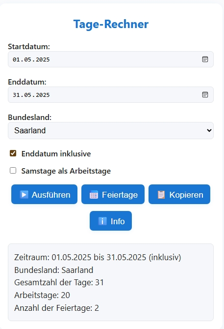

# Tage-Rechner – Arbeitstage und Feiertage in Deutschland

## Übersicht

**Tage-Rechner** ist ein komfortables Tool zur Berechnung von Gesamt- und Arbeitstagen zwischen zwei beliebigen Daten. Es berücksichtigt Wochenenden und alle gesetzlichen Feiertage für ein auswählbares deutsches Bundesland. Das Programm bietet viele Komfortfunktionen für den täglichen Einsatz in Büro, Verwaltung, Projektmanagement oder der privaten Planung.

## Verfügbare Versionen

Das Tool ist in zwei Varianten verfügbar:

### 1. Python-Version (desktop-basiert)
- **Moderne grafische Oberfläche mit Tkinter**
- **Native Desktop-Anwendung für Windows, macOS und Linux**
- **Optimiert für den lokalen Einsatz**

### 2. HTML-Version (web-basiert)
- **Plattformübergreifend im Browser nutzbar**
- **Kein Installation erforderlich**
- **Verfügbar im Verzeichnis `html-js`**
- **Funktioniert auf allen Geräten mit modernem Webbrowser**
- **Ideal für mobile Geräte, Tablets und verschiedene Betriebssysteme**

## Features

- **Einfache Bedienung über eine moderne Benutzeroberfläche**
- **Datumsauswahl per Kalender**
- **Berücksichtigung aller gesetzlichen Feiertage des gewählten Bundeslands (über das [holidays](https://pypi.org/project/holidays/)-Paket)**
- **Option, das Enddatum einzuschließen**
- **Option, Samstage als Arbeitstage zu zählen**
- **Ergebnis kann mit einem Klick in die Zwischenablage kopiert werden**
- **Doppelklick auf ein Datumsfeld trägt das heutige Datum ein**
- **Button zur Anzeige der im Zeitraum berücksichtigten Feiertage in einem eigenen Fenster**
- **Automatische Ergänzung des aktuellen Jahres bei Eingabe im Format TT.MM**
- **Anzeige der Anzahl der berücksichtigten Feiertage im Ergebnisbereich**

## Installation und Verwendung

### Python-Version

#### Installation

1. **Python 3.7 oder neuer installieren**
2. **Benötigte Pakete installieren:**

```bash
pip install tkcalendar holidays pyinstaller
```

#### Verwendung

1. **Skript starten:**

```bash
python daysbetween.py
```

2. **Bedienung:**
    - **Start- und Enddatum**: Per Kalender auswählen oder von Hand eingeben (Format TT.MM.JJJJ oder TT.MM).
    - **Bundesland**: Aus der Liste auswählen, um die passenden Feiertage zu berücksichtigen.
    - **Optionen**:
        - **Enddatum inklusive**: Das Enddatum wird bei der Berechnung mitgezählt.
        - **Samstage als Arbeitstage**: Samstage werden als Werktage gewertet.
    - **Berechnen**: Auf „▶️ Ausführen" klicken.
    - **Feiertage anzeigen**: Zeigt alle im Zeitraum berücksichtigten Feiertage in einem eigenen Fenster.
    - **Kopieren**: Das Ergebnis wird in die Zwischenablage kopiert.
    - **Doppelklick** auf ein Datumsfeld trägt das heutige Datum ein.
    - **Info**: Zeigt eine Kurzanleitung.
    - **Beenden**: Schließt das Programm.

### HTML-Version

#### Installation

Keine Installation erforderlich! Die HTML-Version befindet sich im Verzeichnis `html-js` und kann direkt im Browser geöffnet werden.

#### Verwendung

1. **Öffnen Sie die Datei `index.html` aus dem Verzeichnis `html-js` in einem modernen Webbrowser**
2. **Die Bedienung erfolgt analog zur Python-Version über die webbasierte Benutzeroberfläche**

#### Plattformübergreifende Nutzung

Die HTML-Version bietet maximale Flexibilität:

- **Desktop-Computer**: Windows, macOS, Linux – alle Browser
- **Mobile Geräte**: Smartphones und Tablets (iOS, Android)
- **Embedded Systems**: Raspberry Pi, andere Single-Board-Computer
- **Chromebooks**: Native Unterstützung ohne zusätzliche Software
- **Unternehmensumgebungen**: Funktioniert auch in restriktiven IT-Umgebungen
- **Offline-Nutzung**: Funktioniert auch ohne Internetverbindung nach dem ersten Laden

## Kompilierung zu einer EXE (Windows)

Du kannst das Python-Skript mit [PyInstaller](https://www.pyinstaller.org/) zu einer eigenständigen Windows-EXE kompilieren, die ohne Python-Installation läuft.

**Wichtig:**
Das Paket `holidays` lädt einige Unterpakete dynamisch. Damit alles korrekt funktioniert, müssen diese bei der Kompilierung explizit angegeben werden.

Führe im Ordner deines Skripts folgenden Befehl aus:

```bash
pyinstaller --noconsole --onefile ^
  --hidden-import=holidays ^
  --hidden-import=holidays.utils ^
  --hidden-import=holidays.calendars ^
  --hidden-import=holidays.countries ^
  --hidden-import=holidays.groups ^
  daysbetween.py
```

*(Bei Linux/MacOS entferne die `^` am Zeilenende oder schreibe alles in eine Zeile)*

Nach erfolgreicher Kompilierung findest du die ausführbare Datei im Unterordner `dist`.

## Wichtige Einschränkung: Feiertage vor dem 3.10.1990

Die verwendete Bibliothek [`holidays`](https://pypi.org/project/holidays/) berücksichtigt für Deutschland **keine Feiertage vor dem 3. Oktober 1990** (Tag der Deutschen Einheit).
Das bedeutet:
**Feiertage vor diesem Datum werden nicht erkannt und nicht berücksichtigt**, auch wenn sie historisch existierten.

Weitere Informationen findest du in der [holidays-Dokumentation](https://github.com/dr-prodigy/python-holidays/blob/master/holidays/countries/germany.py).

## Beispiel-Screenshot
### Desktop-VERSION

### WEB-VERSION


## Beispiel-Ergebnis

```
Zeitraum: 01.05.2025 bis 31.05.2025 (inklusive Enddatum)
Bundesland: Saarland
Gesamtzahl der Tage: 31
Arbeitstage: 20
Anzahl der Feiertage: 2
```

## Hinweise

- **Format der Datumsangabe:** TT.MM.JJJJ oder TT.MM (das aktuelle Jahr wird ergänzt)
- **Feiertage:** Es werden alle offiziellen Feiertage des gewählten Bundeslands berücksichtigt, aber nur ab 3.10.1990.
- **Enddatum:** Standardmäßig exklusiv (nicht mitgezählt), kann aber per Option einbezogen werden.
- **Samstage:** Können per Option als Arbeitstage behandelt werden.
- **Feiertagsliste:** Über den Button „Feiertage anzeigen" jederzeit abrufbar.

## Welche Version wählen?

**Python-Version:**
- Optimal für regelmäßige Nutzung am Desktop
- Bessere Performance bei häufiger Verwendung
- Native Betriebssystem-Integration

**HTML-Version:**
- Ideal für gelegentliche Nutzung
- Perfekt für mobile Geräte
- Keine Installation erforderlich
- Universell einsetzbar auf allen Plattformen
- Einfache Weitergabe und Verteilung

## Lizenz

Dieses Projekt steht unter der MIT-Lizenz.

## Weiterentwicklung

Vorschläge, Fehlerberichte oder Pull Requests sind jederzeit willkommen!

## Autor

Erstellt von Dieter Eckstein
Letztes Update: Juli 2025

**Viel Freude mit dem Tage-Rechner!**

<div style="text-align: center">⁂</div>

[^1]: daysbetween.py